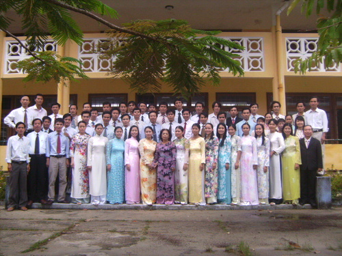

<!DOCTYPE html>
<html>
<head>
	
	<meta charset="utf-8">
	<meta name="viewport" content="width=device-width, initial-scale=1">
	<title>BÁO TRƯỜNG</title>
	<link rel="stylesheet" type="text/css" href="baotuong.css">
</head>
<body>
	

			

		

			<section id="trang-chu">
			

			  
 

			  
<h1 class="tiêu_đề_1"> NĂM THÁNG XƯA CÙNG NGƯỜI LÁI</h1>   <h0> KỶ NIỆM NGÀY NHÀ GIÁO VIỆT NAM 20/11    BÁO TƯỜNG </h0> 

			  

			

		

	

	
 

</section>
			<h2 class="tiêu_đề_2"> LỜI NGỎ </h2>
			
 Kính thưa thầy và các bạn,  
				Trong cuộc đời của mỗi con người đều có những người mà chúng ta không thể nào quên, nếu như cha mẹ là hai đấng sinh thành có công ơn nuôi dưỡng ta từ nhỏ đến lớn thì thầy cô cũng là những người có công không nhỏ. Thầy cô luôn là những người dạy cho ta con chữ, biết thế nào là lẽ phải, điều tốt trên đời, dạy ta biết đối nhân xử thế. Đối với những học sinh vẫn còn cắp sách đến trường như chúng em thì người thầy cũng chính như những người cha, người mẹ thứ hai của chúng em. Tục ngữ, ca dao Việt Nam ta có nhiều câu rất hay nói về thầy cô: “Kính thầy mới được làm thầy” hoặc “Muốn con hay chữ phải yêu kính thầy”. Thật như vậy, nếu không có thầy cô chỉ dẫn dạy bảo thì chúng em sẽ không biết chữ, biết tốt biết hay. Thầy cô luôn là những người đã dìu dắt chúng em vững bước đi trên con đường học vấn. Từ chỗ mà chưa biết gì, chúng em dần dần biết chữ cái đầu tiên, biết đọc, biết viết, biết làm văn, làm toán, biết được thêm nhiều kiến thức phong phú vô tận của nhân loại. Thầy cô đã và luôn giúp cho chúng em có được chìa khóa để mở cánh cửa tri thức trong cuộc sống. Thầy cô là người vun đắp ước mơ cho chúng em, đưa chúng em tới đỉnh cao của kiến thức, hướng về một tương lai tươi đẹp sau này. Mọi người vẫn hay nói thầy cô là những người lái đò cần mẫn đưa biết bao thế hệ học sinh qua bến bờ tri thức. Mỗi khi năm học kết thúc là thêm một lần thầy cô đã đưa học sinh – những con đò cập bến. Hết chuyến đò này lại đến chuyến đò khác, thầy cô đã đưa biết bao nhiêu chuyến đò học sinh trong cuộc đời mình, biết bao thế hệ học trò mà được thầy cô dìu dắt. Công ơn của thầy cô thật là vô cùng to lớn. Ngày lễ 20/11 cũng sắp tới, chúng em sẽ cố gắng luôn học giỏi để dành gửi tặng cho thầy cô những bông hoa điểm mười tươi thắm. Đó chính là sự thể hiện lòng biết ơn của chúng em đối với thầy cô. Chúng em sẽ cố gắng chăm chỉ trở thành người tốt, học tập chăm chỉ để không khỏi phụ lòng thầy cô đã có công ơn dạy bảo chúng em biết bao tháng ngày qua
			

			<section id="chuyen-muc-1">
			<h2 class="tiêu_đề_2"> CHUYÊN MỤC 1:    ĐỐ VUI </h2>
			
 
				
Câu 1: Ai đứng mà không mỏi chân, nói mà không khát nước?

				
Câu 2: Cái gì trắng như tuyết, đứng trước lớp mỗi ngày?

				
Câu 3: Tiên học lễ, hậu học văn; Mái gì dạy dỗ chúng em nên người? 

				
câu 4: Cái gì có chân nhưng chẳng biết đi - có mặt phẳng lỳ cho bạn ngồi lên?

				
câu 5: Cái gì thân thì thẳng đuột.  Ruột thì đen đuốc.   Giúp bé vẽ viết.   Ngày càng ngắn đi 

				
câu 6: Hai đầu mọc ở hai chân  Cái chân lại đúng là thân mới kỳ   Xin bạn một mẩu bút chì    Mượn bạn ngòi bút cũng vì việc chung?   (Đố là cái gì?) 

			

			
 câu trả lời của các câu đố vui 
				 - Các quý thầy,cô
				- Phấn bảng
				- Mái trường
				- Cái ghế đá
				- Cây bút chì
				- Cái compa 
			

			<section id="chuyen-muc-2">	
			<h2 class="tiêu_đề_2"> CHUYÊN MỤC 2:   NGÔI TRƯỜNG VÀ NHỮNG LỜI  </h2> 	
			
 
				Ngôi trường em yêu gắn liền với nhiều kỷ niệm đẹp và khi nhắc đến lòng em lại cứ bồi hồi xúc động, nhất là vào ngày trong đại này, ngày 20/11 ngày nhà giáo Việt và chúng ta biết đấy ình ảnh và âm nhạc luôn có sức mạnh kỳ diệu trong việc truyền tải cảm xúc. Và hôm nay, chúng ta sẽ được trải nghiệm điều đó qua một video và một bài hát đặc biệt dành tặng thầy cô. Những thước phim chân thực để ta nhìn lại rõ hơn về những tháng năm mà trường ta đã cùng nhau đi qua với  giai điệu sâu lắng về tình cảm thiêng liêng giữa thầy và trò. 
			
			<video class="hiển_thị_theo_dòng" src="copy_77486DDF-84DF-43C6-8940-CE93DC3FF662.mp4" controls width="500" height="620"> </video>
			<section id="chuyen-muc-3">
			<h2 class="tiêu_đề_2"> CHUYÊN MỤC 3:   NHỮNG CÂU CHUYỆN NHỎ TRONG LỚP HỌC </h2>
			<audio  class="hiển_thị_theo_dòng" src="BuiPhan-DanTruong-3606619.mp3" controls></audio>
			

				 Ai là người tìm ra châu Mỹ?  
				 Trong giờ địa lý, cô giáo gọi Hà lên hỏi. 
				 - Em hãy chỉ cô biết đâu là châu Mỹ? 
				 Hà chỉ trên bản đồ. 
				 - Thưa cô, đây ạ! 
				 Cô giáo gật đầu: 
				 - Tốt lắm! Nào, thế bây giờ trò Tí hãy nói cho cô biết ai đã có công tìm ra châu Mỹ? 
				 - Thưa cô, bạn Hà ạ. 
				 - !? 
			
	
	

		

  <ul>
  	<h2>DANH MỤC</h2>
     <li><a href="#trang-chu">Đầu Trang</a></li> 
     <li><a href="#chuyen-muc-1">Chuyên Mục 1: ĐỐ VUI</a></li> 
     <li><a href="#chuyen-muc-2">Chuyên Mục 2: NGÔI TRƯỜNG VÀ NHỮNG LỜI NÓI</a></li> 
     <li><a href="#chuyen-muc-3">Chuyên Mục 3: ĐỐ VUI</a></li> 
     <li><a href="#chuyen-muc-4">Bình Luận Và Đóng Góp Ý Kiến</li></a></li> 
  </ul>

	

	<section id="chuyen-muc-4">
		<h2 class="tiêu_đề_1"> BÌNH LUẬN</h2>
		<form action="url" method="GET" class="hiển_thị_theo_dòng">
			<h4>ĐÓNG GÓP Ý KIẾN</h4>
			 <textarea class="ý_kiến" name="họ và tên" rows="5" cols=" 20" ></textarea>
			<input class="ý_kiến" type="submit" name="cmd" value="GỬI" >
		</form>
		
 Nguồn: được sưu tầm từ trang web của trường THPT VINH XUÂN 
 
		<a href="https://thpt-vxuan.thuathienhue.edu.vn/"> TRƯỜNG TRUNG HỌC PHỔ THÔNG VINH </a>
		
 Người làm: Hồ thị Kiều Oanh
lớp: 12b4
		<a href="file:///D:/oanh12b4/baotuong.html#chuyen-muc-4.com">nhấn vào đây đây để vào trang web của tôi</a>

</body>
</html>
